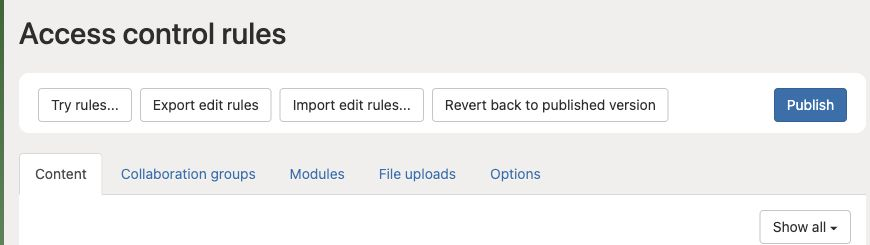

# Test and publish access rules

**Access needed:** Administrator allowed to manage access rules.

Use this task when changing what groups can view, create, edit, delete, or use. Start by recording the currently published rule and a concrete example of the required change.

1. Open **Auth → Access control rules**. Choose the relevant content or module rules.
2. Make the smallest change needed, including the correct user group, content group, category, and ownership condition.
3. Use **Try rules...** to test the edited rules. Follow the dialog's instructions and use representative non-administrator accounts.
4. Check both permitted and forbidden actions, including anonymous access where relevant.
5. Return to the rules screen and **Publish** only the reviewed changes.
6. Repeat the checks with ordinary sessions after publication.

Try rules checks your draft. Publish applies the reviewed rules to ordinary sessions. Keep an export of the rules before making changes.

Edited rules and published rules are separate. **Revert back to published version** discards unpublished rule edits; it is not an undo history for an already published change. Record the old rules so you can reapply and publish them if necessary.

Keep another authorized administrator able to recover access. Testing solely with the administrator account will hide many permission mistakes.
