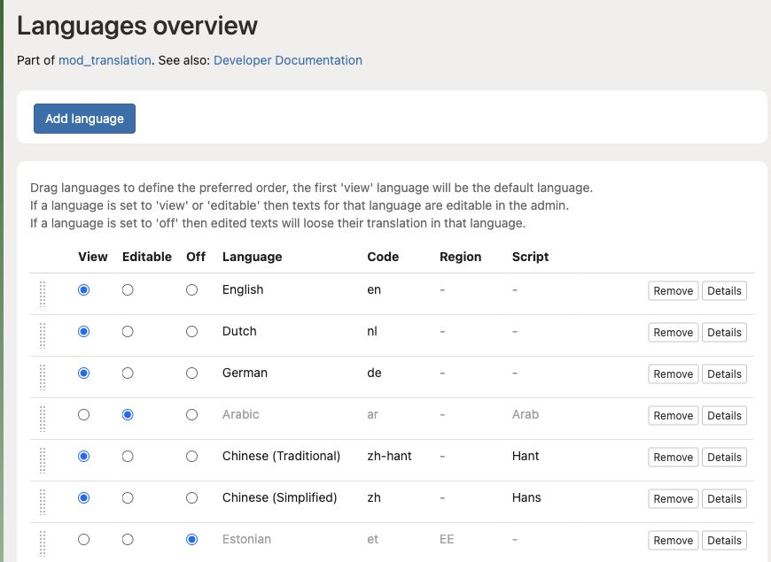

# Add a language and choose its availability

**Access needed:** Site administrator allowed to manage languages.

1. Open **Structure → Translation** and choose **Add language**.
2. Select the intended language and use **Editable** while preparing its content.
3. Ask editors to translate the main pages, menu labels, and essential messages.
4. Check a representative page in that language and verify fallback behaviour for missing translations.
5. Set the language to **View** when it should be available to visitors.
6. Check the language order: the first **View** language is the default. Test the language switcher and incoming links.

This example shows English as the first View language and Arabic as Editable. Use the drag handles to change the preference order.

Changing the default can affect URLs and what new visitors see. Check redirects and search-facing links with the developer before a major language change.

Use **Editable** when hiding a language while retaining an editing workflow. The **Off** option is not an archive switch: the admin warns that subsequent edits can lose translations for an off language. Preserve needed translations before disabling it.
