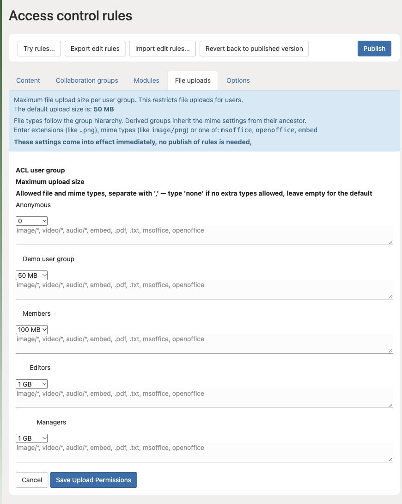

# Set upload sizes and allowed file types

**Access needed:** Administrator allowed to manage access-rule upload settings.

1. Agree which group needs which file types and maximum size. Use a real example file.
2. Open **Auth → Access control rules → File uploads**.
3. Set the group's **Maximum upload size** and allowed extensions or MIME types. Separate type entries with commas.
4. Check the group hierarchy: file-type permissions can be inherited. The screen distinguishes an empty value (the default) from `none` (no extra types).
5. Choose **Save Upload Permissions**, then test with an account in the affected group: one allowed upload and one that should be rejected.
6. Open the resulting media item and confirm processing and download work.

The values shown are test-site examples, not recommended limits. Save Upload Permissions applies these settings immediately; a separate Publish is not needed.

A reverse proxy, server setting, or processing service can impose another limit. If a valid upload is still rejected, collect the size, detected type, account group, time, and error before changing unrelated settings.

Do not permit every file type to solve one failed upload. Renaming an extension does not change a file's actual contents.
