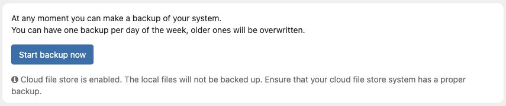

# Create and check a site backup

**Access needed:** Site backup permission; server access for command-line use.

1. Open **Modules → Backup** and resolve any configuration warnings first. The service must be able to run the configured `pg_dump` and archive tools.
2. Choose **Start backup now** for the available full-backup mode. Use **Start database-only backup now** only when that narrower scope is intentional.
3. Wait for completion and check the backup listing, timestamp, files, and any reported error.
4. Copy or replicate the result according to the backup plan. Keep the encryption password separately recoverable if encryption is enabled.
5. Record which database, configuration, media, and external-store protections are included.

Read the scope warning before starting. This example site uses cloud file storage, so recovery of its media needs a separate backup plan.

With cloud file storage enabled, the admin warns that local files will not be backed up; arrange recovery of the external originals. Older daily backups can be overwritten by rotation.

With server access, `bin/zotonic backup garden list` lists backups and `bin/zotonic backup garden start` requests one. Confirm completion independently. Do not use `backup download` for inspection: it downloads **and restores** a backup.
