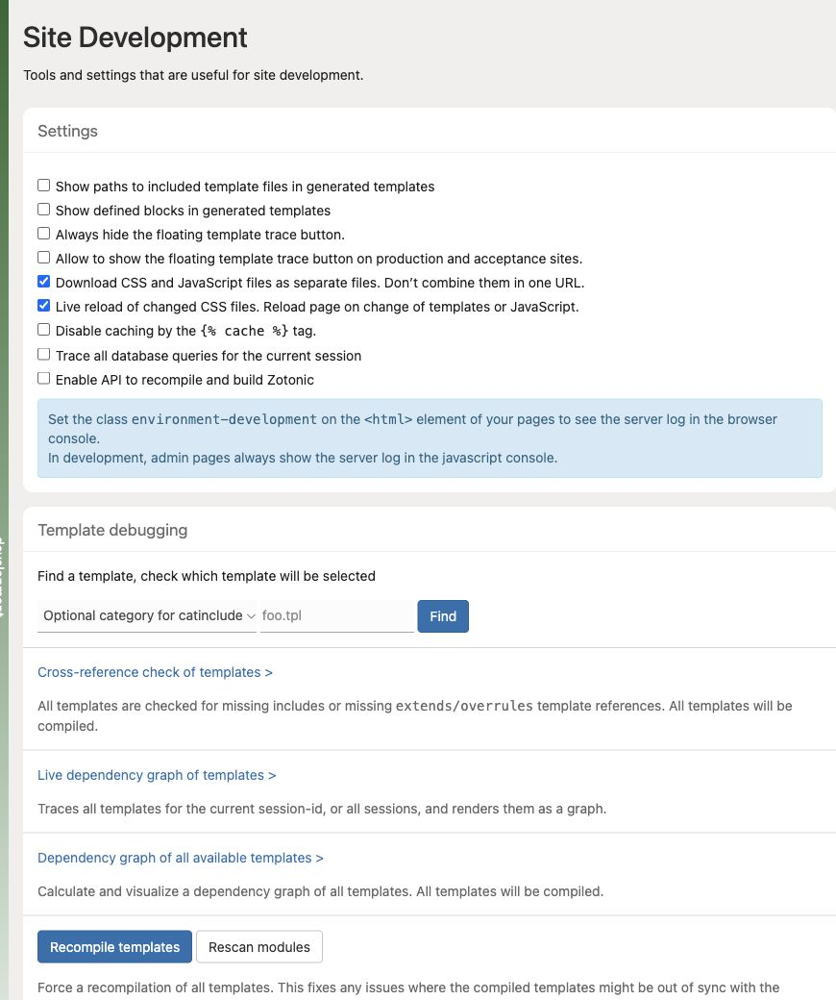

# Choose a development tool

Start with the symptom and use the smallest tool that explains it.

| Symptom | Tool |
| --- | --- |
| Wrong markup | Template selection and live template trace |
| Unexpected URL handling | Dispatch list and path trace |
| Slow page | Database trace, logs, then focused function trace |
| Observer does not run | Observer list and module status |
| Saved changes are missing | Build output, file handling, template selection |
| Result changes after a flush | Cache keys and invalidation |

Open System → Development to find these controls. The checkboxes shown are the test site’s settings; enable only the tools needed for your current investigation.

Enable the Development module on your local site. Keep the ordinary browser developer tools open for network and JavaScript problems. See [Enable the Development module](enable-development.md), [Trace templates rendered by a request](template-trace.md), and [Trace a URL through dispatch](dispatch-debugging.md).
