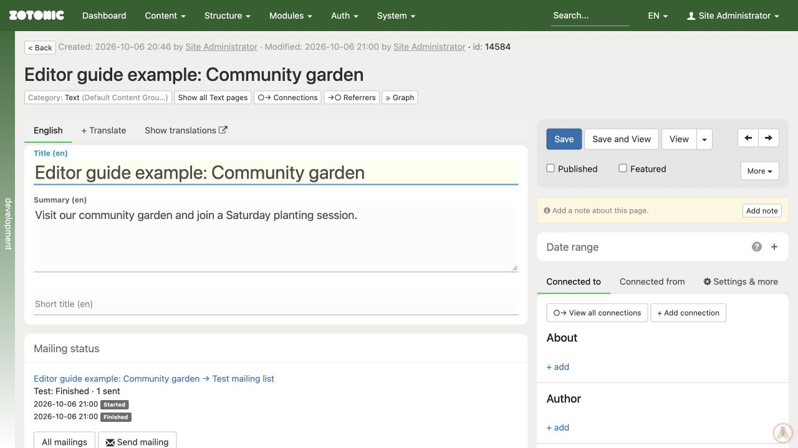

# The admin interface

The admin is the part of your website used to manage content.

- **Dashboard** shows recent changes and shortcuts to pages and media.
- **Content** opens content overviews and tools available on your site.
- **Search** helps you find existing pages.
- The **edit page** contains the title, summary, body text, attached media, and connections.
- **Save**, **Save and View**, and **Published** control saving and publication.

On the current admin, the right-hand side has **Connected to**, **Connected from**, and **Settings & more** tabs. Open **Settings & more** for the publication period, page settings, and optional tools. Older versions may show these panels directly.

Click a panel heading to expand it. Use **View** to open the website version of a saved page. Some content types have no public page of their own.

The edit page, with the title and summary on the left and saving and connection controls on the right.
