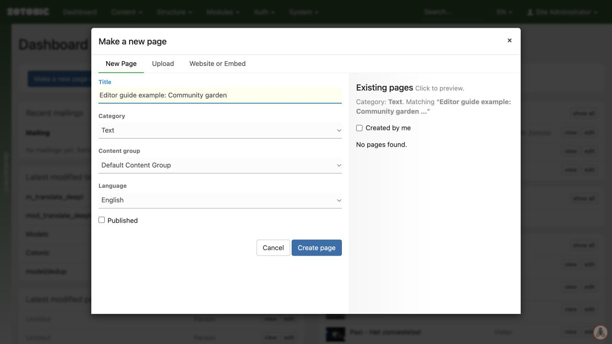

# Your first page

Use this short exercise for a new page that you are allowed to publish.

1. On the dashboard, click **Make a new page or media**.
2. Enter a clear title and choose the appropriate category, such as **Text**.
3. Leave **Published** unchecked and click **Create page**.
4. Write a short summary and a few paragraphs in **Content**.
5. Click **Save**, then **View** to check the saved page while logged in.
6. Return to the edit page, check **Published**, and click **Save** when the page is ready.
7. Open the page in a private browser window to check what a visitor sees.

Publication also depends on the publication period and access settings. A new page does not automatically appear in a menu.

A new Text page with Published left unchecked.

## Check before sharing

Read the saved page on a narrow screen. Follow every link and check that images have useful descriptions. If a private window shows a login page or an error, finish the publication and access checks before sharing the address. For a practice page, unpublish it when the exercise is finished.
