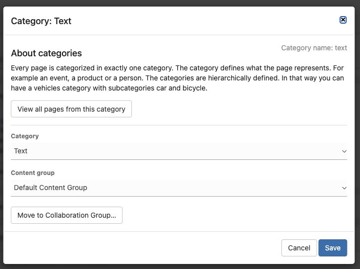

# Changing the category of a page

1. Open the page and save any text changes.
2. Click the category link below the page title.
3. Choose the new category in the dialog and confirm the change.
4. Check the available fields, connections, and public appearance.

Choose the category here. Leave the content group unchanged unless you also intend to change how the page is managed.

On the current admin, **Settings & more** also offers **Change category and/or content group**. A content group controls how content is managed; it is not the same as its category.

Changing category can change the page layout and where it appears in lists. Only select a category that fits the content. If you only want to add a topic such as “Gardening”, use a keyword instead.
