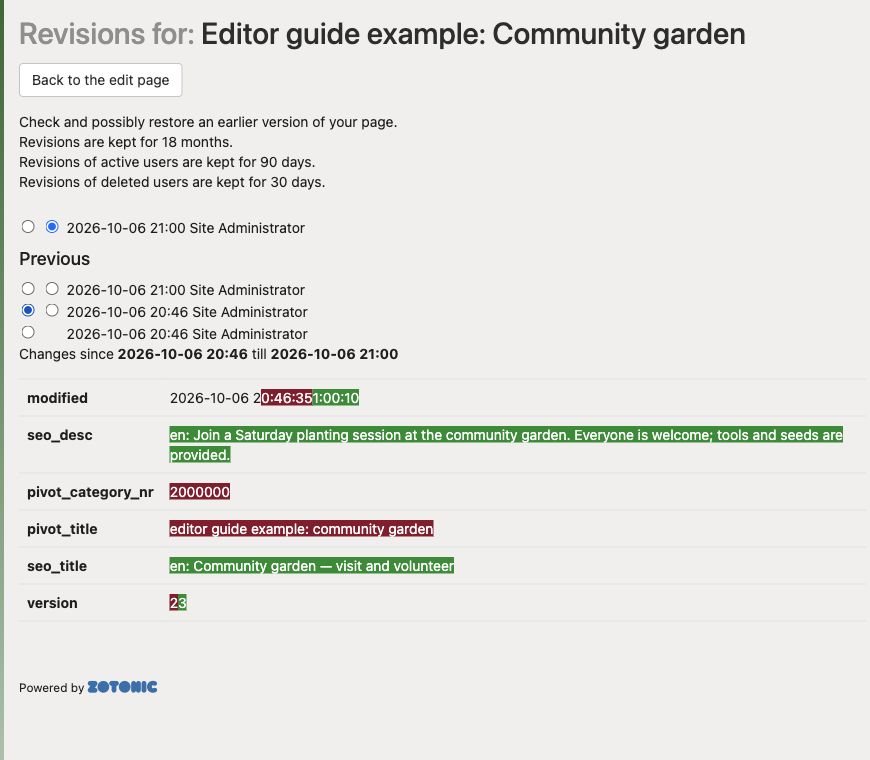

# Viewing and restoring earlier versions

1. Open the page and select **Settings & more**.
2. Expand **Backup & Restore**.
3. Click **List and restore an earlier version**.
4. Compare the saved versions and select the one you need.
5. Review the restore confirmation, restore it, and check the current page.

Select two saved versions to compare them. Added text is highlighted in green and removed text in red. Comparing versions does not restore one.

This feature must be enabled on your site. If the panel is missing, ask your website manager for help.

Restoring an earlier version replaces current page content. Coordinate with other editors so their recent work is not lost. Revision history is not a complete backup of every connection and media file. Check attached media, menu entries, and connections separately after recovery.
