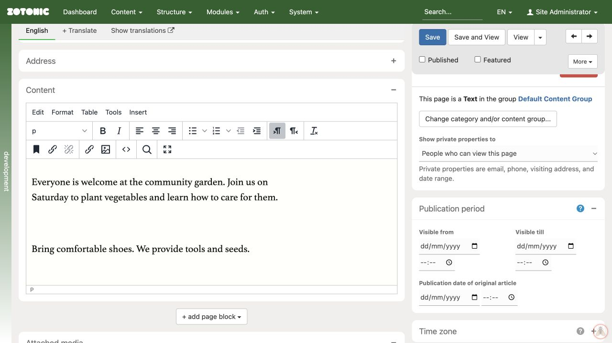

# Publication dates

Open **Settings & more → Publication period** on the edit page.

- **Visible from** is the start of the publication period.
- **Visible till** is the end of the publication period.
- **Publication date of original article** records an original publication date; it does not replace the visibility period.

Check the date and time together. Use the page's **Time zone** panel if the timing is unclear. A future start or an expired end can keep a page from visitors even when **Published** is checked.

The separate **Date range** panel describes the content itself, such as an event's start and end. Changing an event date is not the same as scheduling publication.

After editing publication dates, click **Save** and check the result with a visitor account or private window.

Publication period with Visible from, Visible till, and the original article date.
