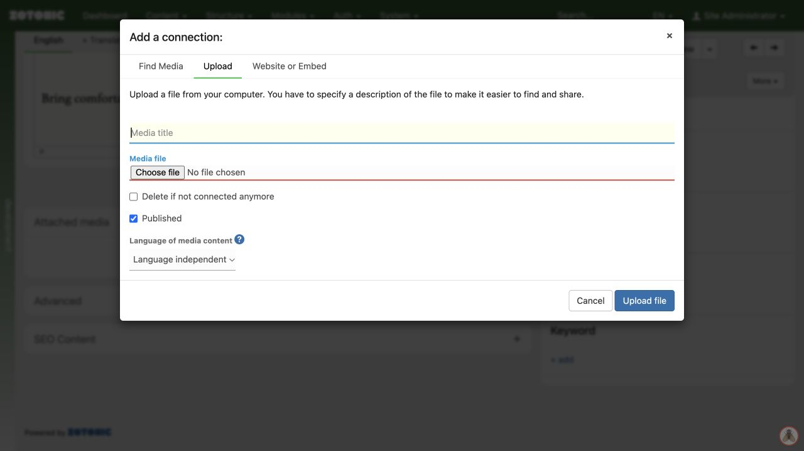

# Uploading an image

1. Open **All media** and choose the upload or new-media action. You can also upload through **add media item** on a page.
2. Open the **Upload** tab and select the image file.
3. Enter a useful title, such as “Volunteers planting at the community garden”.
4. Review the available publication and content-group options, then complete the upload.
5. Open the resulting media item and check the image, description, and any credit or license information.

Use a sharp original that you have permission to publish. The website normally creates smaller display versions for you. Your account may have limits on file types and upload size.

Uploading to the media library does not by itself place the image on a particular page.

Upload dialog with a title, file selection, and media language.
