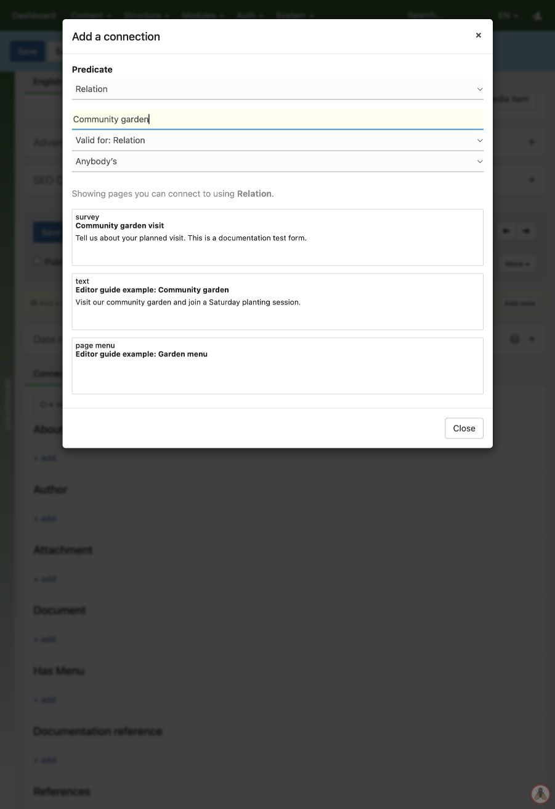

# Connecting pages

1. Open the source page for editing.
2. In **Connected to**, find the type of connection you need and click **add**. Use **Add connection** for other available types.
3. Search for the destination page and check its preview.
4. Select it, then check that it appears under the intended connection type.
5. View the public page to see how the site uses that connection.

Choose the connection type, then search for the destination. In this example, selecting “Community garden visit” would connect the article to the survey.

For example, connect an article to a person under **Author**. This records an authorship relationship; it is different from putting a text link in the article.

Connection changes can be saved immediately. Use **Connected from** on the destination to see incoming connections. The site design determines which relationships it displays.

To correct a connection, remove the incorrect relationship and select the right destination. This removes the connection, not the destination page. Reopen **Connected to** to confirm the saved result. Do not add a reverse connection merely to make it appear under **Connected from**: Zotonic already shows incoming connections there.
