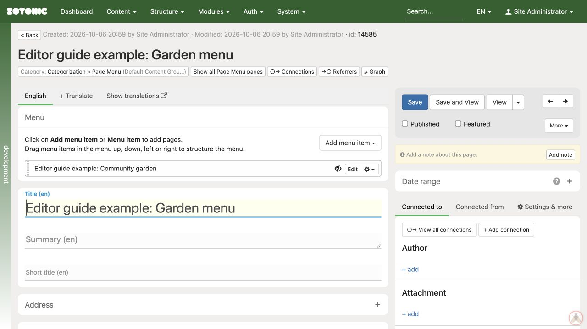

# Editing the main menu

1. Open **Content → Menu** if that shortcut is available, or find the menu page in **All pages**.
2. Check that you are editing the main menu rather than a footer or another menu.
3. Inspect the menu tree and add or move items as needed.
4. Reload the editor to check the saved structure.
5. Check the public navigation, including on a narrow screen.

Menu changes can be saved as you make them. Do not assume that closing the editor cancels a move.

Your site may use a different navigation setup. If there is no menu editor, ask your website manager which content controls navigation. Creating a menu resource alone does not make the website display it.

An example menu containing an unpublished page; the eye symbol marks its unpublished status.
