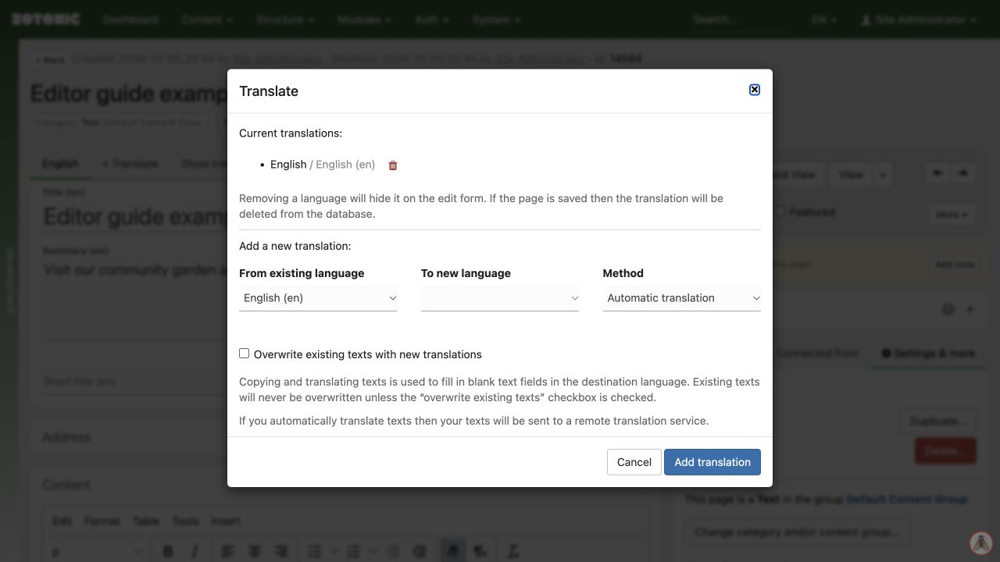

# Translating a page

1. Open the page and save any current changes.
2. Click **+ Translate**.
3. Choose **From existing language** and **To new language**.
4. Choose **Copy texts**, **Leave texts empty**, or **Automatic translation** if available.
5. Click **Add translation**.
6. Open the destination language tab, translate or review every field, and **Save**.
7. View the page in that language and test its links.

Copying provides a starting point; it does not translate the text. Automatic translation needs editorial review too. When offered, it sends the text to the configured translation service.

Existing destination text is preserved unless you select **Overwrite existing texts with new translations**. Use that option carefully.

The translation dialog with source, destination, method, and overwrite options.

On an already published page, saving a translation can expose the new text immediately. Agree on a review process before copying untranslated text into a language offered to visitors. Check shared fields and connections separately: changing an image or publication setting may affect every language.
