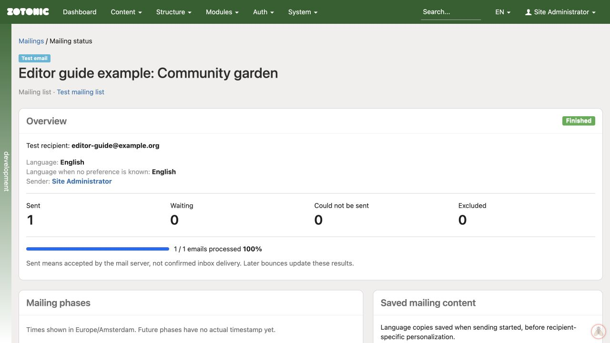

# Checking mailing status

1. Open **View mailing history** from the page's **Mailing list** panel, or open **All mailings** from the dashboard.
2. Select the relevant run, checking the page, list, language, and start time.
3. Read its status, progress, and recipient outcomes.
4. Inspect failures before retrying or sending again.

A queued message has not necessarily been sent. A message accepted by a mail server has not necessarily reached the inbox or been read. Use the labels and details on the run to distinguish those outcomes.

If retrying, review the previous-delivery options so people do not receive unintended duplicates. Give your website manager the run link and error details when delivery appears stuck or fails repeatedly.

A completed test mailing: one message accepted by the mail server.
