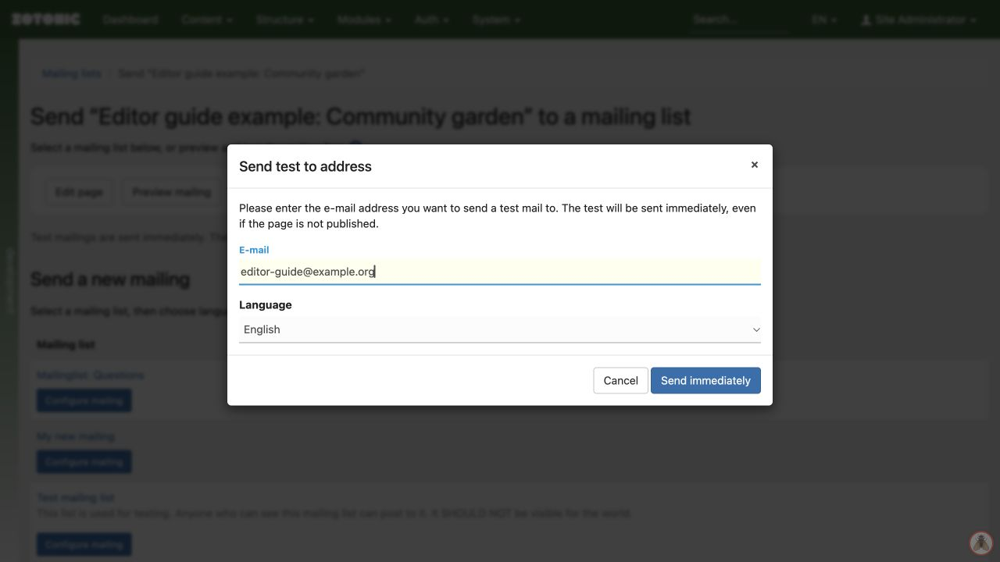

# Sending a test mailing

1. Save the content page and open its **Mailing list** panel under **Settings & more**.
2. Choose **Send test email**, or use the test controls within the mailing dialog.
3. Enter your test address and choose the language if offered.
4. Send the test and inspect it in an email client.
5. Check the title, text, images, links, layout, and footer. Correct the page and test again if needed.

A test can be sent immediately even when the page is unpublished, provided you can view it. A successful test does not prove that the full audience settings are right.

Before a full send, review the actual list, language selection, eligible count, previous-delivery option, and timing separately.

The single-address test dialog with an example email address.
