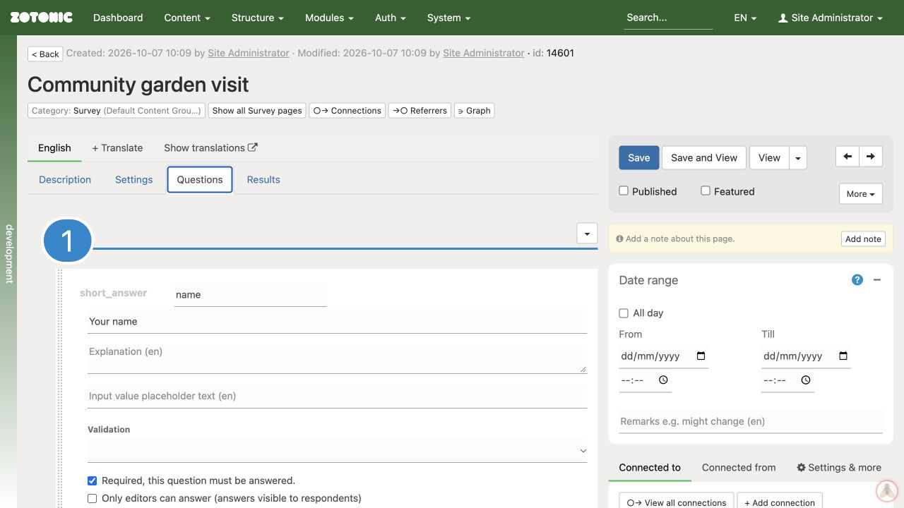

# Adding and arranging questions

1. Open the form's **Questions** tab and click **Add question**. If there is no question page yet, click **Add page** first.
2. Choose the question type in **Add a question or block**.
3. Give the question a short, unique **name**, such as `visitor_name` or `email`. This identifies the answer; it is not the wording shown to visitors.
4. Write the question in the prompt field. Add an explanation when people need help answering.
5. Select **Required, this question must be answered** only when the form cannot work without that answer.
6. For a short-answer field, choose **Validation** when it must contain an email address, number, phone number, or date.
7. Use the up/down controls or drag handle to arrange questions. Save and check their order with **View**.

| Choose | For |
| --- | --- |
| Short answer | A name or a single value; validation checks its format |
| Long answer | A comment or explanation |
| Yes or no | A clear choice between two answers |
| Multiple choice or quiz question | One or several choices, with translatable labels |
| 5-point scale | Agreement with a statement |
| Header or Text, image, video | Instructions between questions |

Keep names unique and unchanged once responses exist. Translate prompts and answer labels, not the names used to identify them.

**Only editors can answer** makes the field read-only for respondents, but they may still see its prompt and saved answer. It is not a private internal note. **Hide from results** is a display option, not a guarantee that the answer is never stored or accessible.

A file-upload question belongs on the final question page. The standard result email can carry uploads as attachments, but the file is not a normal stored survey answer. Ask your website manager how files will be delivered and retained before using it.
