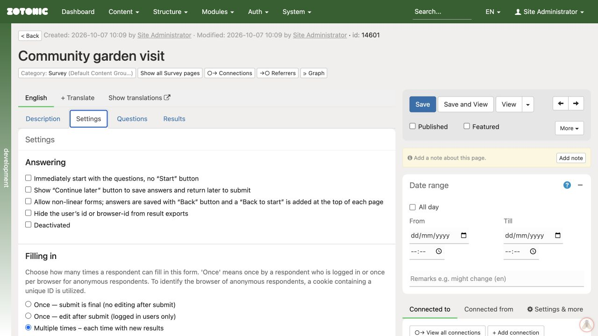

# Choosing how people can respond

Open the form's **Settings** tab before inviting people to respond.

Under **Filling in**, choose one mode:

- **Once — submit is final:** respondents cannot edit their submitted answer.
- **Once — edit after submit:** logged-in respondents can return to edit their own answer. Anonymous respondents cannot use this editing mode after submission.
- **Multiple times:** each submission creates another response.

For anonymous respondents, “once” is based on a browser cookie, not verified identity. Another browser or a cleared cookie can appear to be another respondent.

**Continue later** saves progress before final submission; it is separate from editing a submitted answer. Test returning in the same browser and with the intended login arrangement before promising that progress can be resumed.

Set **Maximum number of submissions** when the form has a limit, or leave it empty for no limit. Test responses count too. Custom handlers may not store results, which can make limits and repeat-submission checks unavailable; ask your website manager if a special handler is selected.

Under **Show after the final submit**, choose the thank-you text, the respondent's results, or aggregated results. Use thank-you text for registrations unless respondents have a reason to see results. Review what aggregate output reveals before offering it.

Save the settings and test them as the intended respondent. An administrator may see controls and data that an ordinary respondent cannot.
