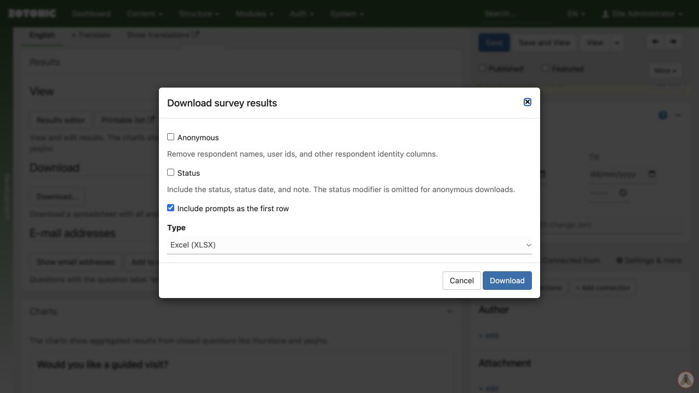

# Downloading survey results

You need permission to download results, and the site's export feature must be enabled.

1. Open the survey's **Results** tab and click **Download…**.
2. Choose **Anonymous** to remove respondent identity columns from the export, if appropriate.
3. Select **Status** only if the recipients need internal status information and notes. This choice is available to survey editors.
4. Decide whether to include question prompts as the first row.
5. Choose **Excel (XLSX)**, **CSV**, or **JSON**, then **Download**.
6. Open the file and check its question columns, response count, and a known test response before sharing it.

An anonymous export is not necessarily anonymous content. A name or email entered as an answer, or identifying details in free text, can still identify someone. Inspect the actual file before sharing it. The form setting that hides user/browser identifiers does not remove information people type into questions.

Keep exported files where only the intended people can access them. They are independent copies: deleting or correcting a response in Zotonic does not update an earlier download.

**Show email addresses** and **Add to mailinglist** are separate tools. Do not add respondents to a newsletter simply because they supplied an address for a registration or request.
