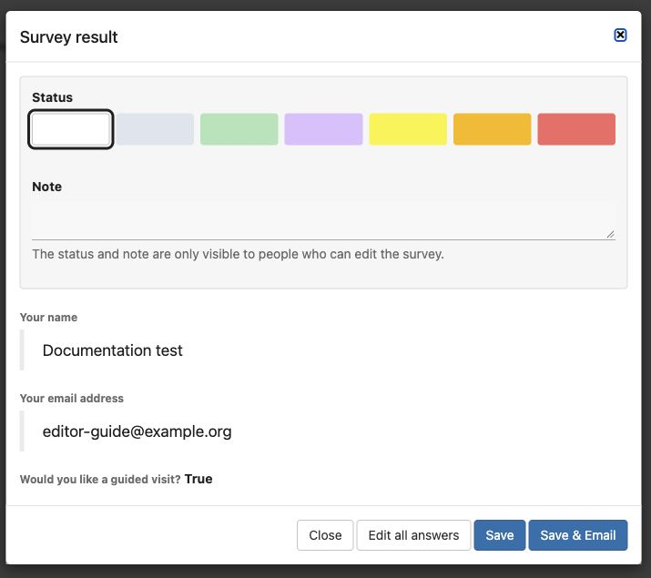

# Reviewing and following up on responses

1. Open the survey's **Results** tab and choose **Results editor**.
2. Find a response by its date and identifying details. Choose **View answers** to read it.
3. Set a **Status** and internal **Note** if your team uses them. Agree what the colours mean; the default statuses do not define a workflow for you.
4. Click **Save** to record the changes.

Read the answers below the internal status and note. Save & Email also sends a message; ordinary Save records your changes without that action.

The status and note are visible only to people who can edit the survey. **View answers** keeps respondent answers read-only but allows editor-only answers to be completed. Those editor-only answers can be visible to the respondent; use the internal note for internal follow-up.

Use **Edit all answers** only when correcting the response itself is intended. Check the entire response before saving. **Save & Email** also sends a message to the respondent; use it deliberately and check the destination. Editor-only answers can be included in this message even when ordinary confirmations omit answers.

The results list can link a response to a person. Check the match carefully; this is separate from creating login credentials.

Use **Show charts** for summaries of closed questions and **Printable list** for a readable overview. Charts are not a substitute for reading open comments. A configured special handler may send responses elsewhere instead of saving them here.

Delete only the intended response and read the confirmation. Deleting a response does not recall emails or exported copies.
