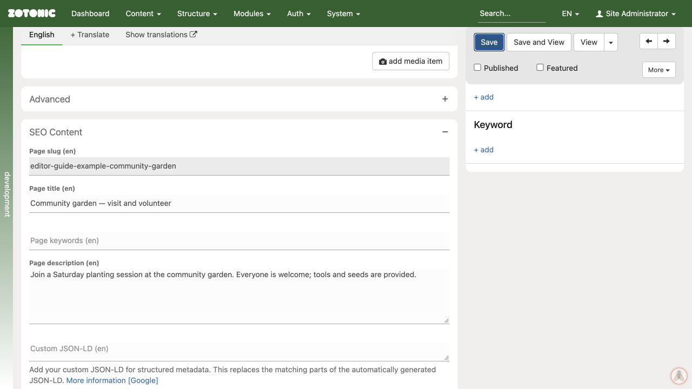

# Page titles and descriptions

::: aside
Search engines can shorten or replace the supplied title and description, so do not rely on a fixed character count to guarantee their display.
:::

1. Open the page and expand **SEO Content**.
2. Use **Page title** when the browser or search title needs to differ from the content title.
3. Write a concise **Page description** that accurately summarizes the page.
4. Check each language you maintain.
5. Save and view the public page.

Keep the main message near the start.

When these fields are empty, your site may use the ordinary title and summary. The fallback depends on the design. Leave technical fields such as custom structured data to the people responsible for the site's implementation.

Page-level SEO title and description for the example page.
