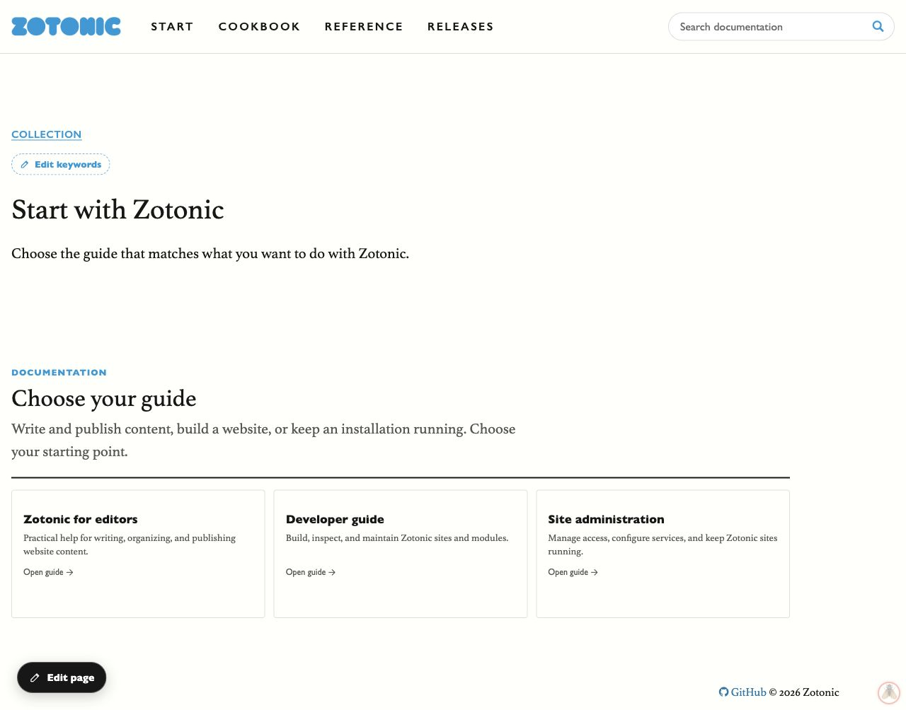

# Test-site import and navigation review — 7 October 2026

Imported into `zotonicwww2`, environment `development`. Production was not changed.

- Imported 383 documentation pages and 28 media resources, keywords and 793 connection groups.
- All 383 pages are anonymously visible and return successful HTML with exactly one main heading.
- All 27 distinct rendered image URLs return nonempty image responses.
- All 318 source guide resources resolve to pages with guide navigation (adopted aliases reuse existing pages).
- Reviewed editor, developer and administration guide roots and sections in the browser, including survey questions and the media sandbox article.
- Checked mobile layout at 390 × 844: no horizontal page overflow; expandable contents remain usable. Reset the viewport afterwards.
- Tufte asides render as margin notes. Task lists retain their visible numbers.
- Repeat import creates no pages and changes no texts or connection groups.

## Changes made during review

The start page uses its `haspart` connections to show all three guides. Guide pages
have visible breadcrumbs, expandable section contents with the current page marked,
ordered contents cards, and previous/contents/next navigation before related links.
Older background articles remain accessible in a separate expandable list.
Shared sections keep the selected guide in a validated `guide` query parameter;
invalid or unrelated values fall back to an existing visible path.

Fixed import ordering to respect each manifest edge's explicit `sequence`, including
Surveys and forms in position 10. Normalized empty translations when comparing
updates, avoiding repeated writes for three historical pages without summaries.

## Checks

Python source/plan validation, Erlang compilation, three importer unit tests,
rollback-only importer integration checks, and rollback-only navigation checks
passed. Navigation fixtures cover hidden siblings, first/last boundaries, shared
sections and cycle protection. Fixture rows were rolled back.

